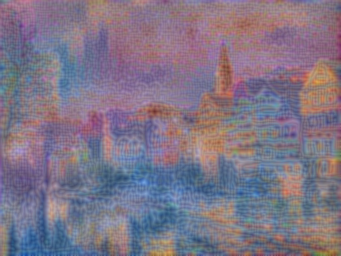
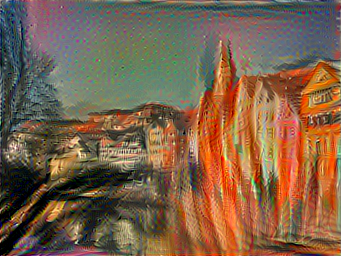
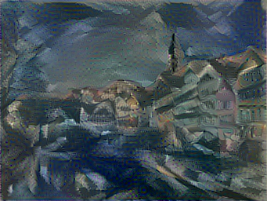
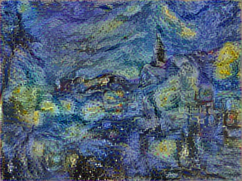
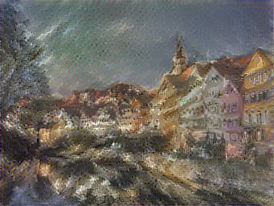
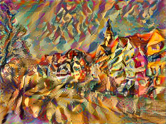

# neural stylization

An **implementation** of the paper
[_A Neural Algorithm of Artistic Style_](https://arxiv.org/abs/1508.06576).


## Claude Monet's _Houses of Parliament_

<p float="left">
  
 
</p>

## Edvard Munch's _The Scream_

<p float="left">
  
 
</p>

## Pablo Picasso's _Seated Nude_

<p float="left">
  
 
</p>

## Vincent van Gogh's _The Starry Night_

<p float="left">
  
 
</p>

## William Turner's _The Shipwreck of The Minotaur_

<p float="left">
  
 
</p>

## Wassily Kandinsky's _Composition VII_

<p float="left">
  
 
</p>

## Getting Started

These instructions will get you a copy of the project up and running on your
local machine for development and testing purposes. See deployment for notes
on how to deploy the project on a live system.

### Prerequisites

1.  [python3][] - Programming Environment
1.  [pip3][] - Python Dependency Management

[python3]: https://python.org
[pip3]: https://packaging.python.org/tutorials/installing-packages/

### Installing

To install dependent modules:

```shell
pip3 install -r requirements.txt
```

## Project Components

[neural_stylization][] contains Python modules with utility methods and
classes for the project.

[neural_stylization]: neural_stylization

### VGG19

This project relies on the VGG19 architecture.
[VGG19-classification.ipynb][] outlines some basic image classification
using the network with weight-set **W** pre-trained on the ImageNet
dataset. The implementation of VGG19 can be found in
[neural_stylization/vgg19.py][]. Utility methods for loading manipulating,
and normalizing image can be found in [neural_stylization/img_util.py][].

[VGG19-classification.ipynb]: VGG19-classification.ipynb
[neural_stylization/vgg19.py]: neural_stylization/vgg19.py
[neural_stylization/img_util.py]: neural_stylization/img_util.py

### Content Reconstruction

[content-reconstruction.ipynb][] describes the content reconstruction
process from white noise. Performing gradient descent of the content loss
on a white noise input **x** for a given content **p** yields a
representation of the networks activation for a given layer _l_.

[content-reconstruction.ipynb]: content-reconstruction.ipynb

### Style Reconstruction

[style-reconstruction.ipynb][] describes the style reconstruction
process from white noise. Performing gradient descent of the style loss
on a white noise input **x** for a given artwork **a** yields a
representation of the networks activation for a given set of layers _L_.

[style-reconstruction.ipynb]: style-reconstruction.ipynb

### Style Transfer

[style-transfer.ipynb][] describes the style transfer process between a white
noise image **x**, a content image **p**, and a style representation **a**.
Performing gradient descent of the content loss and style loss with respect
to **x** impressions the content of **p** into **x**, bearing local styles,
and colors from **a**.

[style-transfer.ipynb]: style-transfer.ipynb

# Acknowledgments

-   [keras-team](https://github.com/keras-team) provides `Keras`, a high
	level neural network framework. They also provide the pre-trained
	ImageNet weights and some tutorials that help build this project.

# How Should I Cite `neural-stylization`?

Please cite `neural-stylization` if you use it in your work using the
following block:

```latex
@misc{neural-stylization,
  author = {Christian Kauten and Behnam Rasoolian},
  title = {neural-stylization},
  year = {2018},
  publisher = {GitHub},
  howpublished = {\url{https://github.com/Kautenja/neural-stylization}},
}
```
